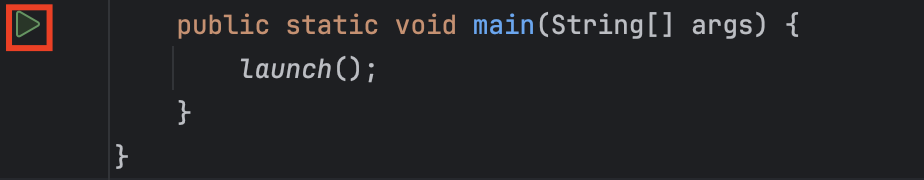
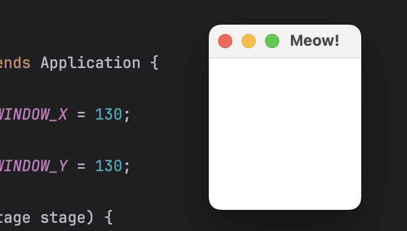
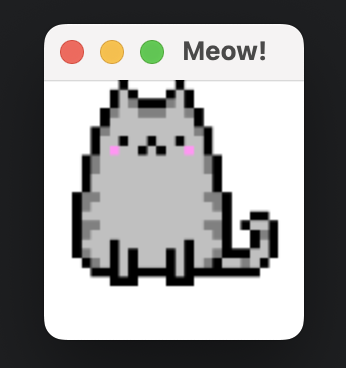

# Create a Simple JavaFX Project

## Overview
In this section, you will set up the basic skeleton of a JavaFX project. For this tutorial, we will create a window that displays an image.

## Let's get started
1. Import the Application class:<br /> 
   ```linenums="1"
   import javafx.application.Application;
   ```
   This will be the entry point to your JavaFX project.
2. Create a class for your JavaFX project: <br /> 
    ```linenums="1" hl_lines="3-10"
    import javafx.application.Application;

    public class ImageDisplay extends Application {
        public void start(final Stage stage) {
        }

        public static void main(String[] args) {
            launch();
        }
    }
    ```
    The start method is an abstract method implemented to be the entry point to your JavaFX project.
3. Add instance variables to specify the size of the window to be generated. Let's make the height of the window to be 130 pixels, and the width to be 130 pixels:
    ```linenums="1" hl_lines="4-5"
    import javafx.application.Application;

    public class ImageDisplay extends Application {
        private static final int WINDOW_X = 130;
        private static final int WINDOW_Y = 130;

        public void start(final Stage stage) {
        }

        public static void main(String[] args) {
            launch();
        }
    }
    ```
4. Import the Group class, and create a root node using this class: 
    ```linenums="1" hl_lines="2 8-10"
    import javafx.application.Application;
    import javafx.scene.Group;
    
    public class ImageDisplay extends Application {
        private static final int WINDOW_X = 130;
        private static final int WINDOW_Y = 130;

        public void start(final Stage stage) {
            Group root = new Group();
        }

        public static void main(String[] args) {
            launch();
        }
    }
    ```
    Think of the window we will create as a painting; the root node creating using the Group class is a collection of the individual elements we wish to put on this painting.
5. Import the Scene class, and create a new scene:
    ```linenums="1" hl_lines="3 11"
    import javafx.application.Application;
    import javafx.scene.Group;
    import javafx.scene.Scene;
    
    public class ImageDisplay extends Application {
        private static final int WINDOW_X = 130;
        private static final int WINDOW_Y = 130;

        public void start(final Stage stage) {
            Group root = new Group();
            Scene scene = new Scene(root, WINDOW_X, WINDOW_Y);
        }

        public static void main(String[] args) {
            launch();
        }
    }
    ```
    Think of the Scene class as the canvas for our painting. 
6. Now that we have a canvas, let's give a title to the canvas and put it on display:
    ```linenums="1" hl_lines="12-14"
    import javafx.application.Application;
    import javafx.scene.Group;
    import javafx.scene.Scene;
    
    public class ImageDisplay extends Application {
        private static final int WINDOW_X = 130;
        private static final int WINDOW_Y = 130;

        public void start(final Stage stage) {
            Group root = new Group();
            Scene scene = new Scene(root, WINDOW_X, WINDOW_Y);
            stage.setTitle("Meow!");
            stage.setScene(scene);
            stage.show();
        }

        public static void main(String[] args) {
            launch();
        }
    }
    ```
7. Run the program through one of the following ways:
      * Clicking on the green triangle beside the main method
        
      * Clicking on the green triangle at the top right of the IntelliJ window
      * Right click ImageDisplay.java and select Run 'ImageDisplay.main()' from the dropdown menu <br /> 
      * Using the shortcut ++ctrl+shift+r++ on Mac, or ++ctrl+r++ on Windows
    <br /> 
    <br /> 
    You should see a window pop up after running the program:
    
8. Add the cat image to the resources folder:
   
9. Import ImageView class and create an ImageView with the cat image we just added:
    ```linenums="1" hl_lines="4 11"
    import javafx.application.Application;
    import javafx.scene.Group;
    import javafx.scene.Scene;
    import javafx.scene.image.ImageView;
    
    public class ImageDisplay extends Application {
        private static final int WINDOW_X = 130;
        private static final int WINDOW_Y = 130;

        public void start(final Stage stage) {
            ImageView img = new ImageView("cat.png");
            Group root = new Group();
            Scene scene = new Scene(root, WINDOW_X, WINDOW_Y);
            stage.setTitle("Hello!");
            stage.setScene(scene);
            stage.show();
        }

        public static void main(String[] args) {
            launch();
        }
    }
    ```
10.  Add the image to the root, since it is an element we want to display on our canvas:
    ```linenums="1" hl_lines="12"
    import javafx.application.Application;
    import javafx.scene.Group;
    import javafx.scene.Scene;
    import javafx.scene.image.ImageView;
    
    public class ImageDisplay extends Application {
        private static final int WINDOW_X = 130;
        private static final int WINDOW_Y = 130;

        public void start(final Stage stage) {
            ImageView img = new ImageView("cat.png");
            Group root = new Group(img);
            Scene scene = new Scene(root, WINDOW_X, WINDOW_Y);
            stage.setTitle("Hello!");
            stage.setScene(scene);
            stage.show();
        }

        public static void main(String[] args) {
            launch();
        }
    }
    ```
11.  Run the program. <br /> 


!!! success
    You should see the cat image display in the JavaFX window we created!<br /> 
    

## Conclusion
By the end of this section, you will have learned how to do the following:<br /> 

- [x] How to create the entry point to your JavaFX project
- [x] How to set up a window for your JavaFX project
- [x] How to load and display an image in JavaFX

These are the basics to starting a JavaFX project. Refer to the [official JavaFX documentation](https://docs.oracle.com/javase/8/javafx/api/toc.htm) or other online tutorials to create more complex projects. The Internet is your oyster!

---
<sub>
1. [Class Application](https://docs.oracle.com/javase/8/javafx/api/javafx/application/Application.html)<br /> 
2. [Class Group](https://docs.oracle.com/javase/8/javafx/api/javafx/scene/Group.html)<br /> 
3. [Class Scene](https://docs.oracle.com/javase/8/javafx/api/javafx/scene/Scene.html)<br /> 
4. [Class ImageView](https://docs.oracle.com/javase/8/javafx/api/javafx/scene/image/ImageView.html)
</sub>
